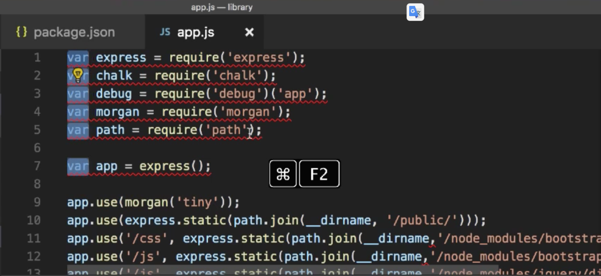

# cheatSheet

Dev notes I often need. Visit at [cheatSheet.software](http://cheatsheet.software).

<!-- @import "[TOC]" {cmd="toc" depthFrom=1 depthTo=6 orderedList=false} -->

<!-- code_chunk_output -->

* [cheatSheet](#cheatsheet)
	* [Node](#node)
		* [Node Version Manager (NVM)](#node-version-manager-nvm)
		* [Linting](#linting)
		* [JS, OOP and the sort](#js-oop-and-the-sort)
			* [Destructuring & default values](#destructuring-default-values)
			* [Optional chaining](#optional-chaining)
		* [Logging](#logging)
			* [Debug](#debug)

<!-- /code_chunk_output -->

## Node

### Node Version Manager (NVM)

To manage the different versions of Node it makes sense to use the Node version Manager (NVM). 

* [`nvm` usage](https://github.com/creationix/nvm#usage)
* [Checking the installed Node version as Jest test](https://gitlab.com/tillg/scrapeMachine/blob/master/test.js)


### Linting

For linitng I use [ESLint](https://eslint.org/) as it seems to be the standard.

What Jonathan Mills suggests in [his course](https://app.pluralsight.com/library/courses/nodejs-express-web-applications-update/table-of-contents):

```shell
npm i eslint --save-dev

./node_modules/.bin/eslint --init
> Use a populat style guide
> Airbnb

## To run it:
./node_modules/.bin/eslint app.js

## To fix problems automagically:
./node_modules/.bin/eslint --fix app.js 

## Create a script in your package.json:
"lint": "eslint app.js"
## and run it:
npm run lint
```

In order to use `eslint` together with the code formatter `prettier`, follow [this guide](https://blog.gojekengineering.com/eslint-prettier-for-a-consistent-react-codebase-eaa673debb1d).

### JS, OOP and the sort

* [OOP in JS on Mozilla](https://developer.mozilla.org/en-US/docs/Learn/JavaScript/Objects/Object-oriented_JS)
* Very helpful: [The Object Explorer](https://sdras.github.io/object-explorer/) and [the Array Explorer](https://sdras.github.io/array-explorer/)
* About [Getter](https://developer.mozilla.org/en-US/docs/Web/JavaScript/Reference/Functions/get) and [Setter](https://developer.mozilla.org/en-US/docs/Web/JavaScript/Reference/Functions/set) on Mozilla.
* A nice roundup explanation of [Node Modules, ES6, require...](https://stackabuse.com/how-to-use-module-exports-in-node-js/)

#### Destructuring & default values
The old way:
```javascript
const result = axios.get(`https://ironhack-pokeapi.herokuapp.com/pokemon/${entry.id}`)
const data = result.data
```

Destructured:
```javascript
const { data } = await axios.get(...)

// With renaming the varaible:
const { data: newData } = await axios.get(...)
```

Destructuring and setting default values:
```javascript
const { id = 5 } = {}
```
This can also be used as function params:
```javascript
function calculate({operands = [1, 2], type = 'addition'} = {}) {...}
```

#### Optional chaining
The old way:
```javascript
let data
if(myObj && myObj.firstProp && myObj.firstProp.secondProp && myObj.firstProp.secondProp.actualData) data = myObj.firstProp.secondProp.actualData
```
The new way:
```javascript
const data = myObj?.firstProp?.secondProp?.actualData
```

### Logging

#### Debug

My current chosen tool for logging / debugging is `debug`. 

Using `debug`:

Install and require `chalk` and `debug` : `npm i chalk debug`

In your code:

 ```javascript
 var chalk = require('chalk');
 var debug = require('debug')('app');
 ```

The `('app')` behind the require indicates the name of your module / file. You can structure your debugging scopes by using `:` like so:

 ```javascript
 var debug = require('debug')('app:routes');
 ```

Use `debug` statement to log:

 ```javascript
 app.listen(3000, function(){
   debug(`Listening on port ${chalk.green('3000')}`);
 })
 ```

Activate debugging when launching the node environment by passing the `DEBUG` environment variable (ideally as an npm script :) ):

```shell
DEBUG=* node app.js
or
DEBUG=app:*,express:* node app.js
 ```

#### Winston

----

**Note** I used to use winston as logging tool but plan to move to dubug instead as it is smaller & simpler.

----

Some Winston documents:

* [Getting Started Quickly With Node.js Logging, April 2018, Erik Dietrich](https://blog.scalyr.com/2018/04/getting-started-quickly-node-js-logging/)
* [The source of winston documentation: The winston Repo ;)](https://github.com/winstonjs/winston)

In case you want to log JSON files to the console use [prettyjson](http://rafeca.com/prettyjson/).

### Building Path names

When building path names, don't use `+` to concatenate string, use the `path` module (it's integrated in node, no need to `npm install`, just `require` it).

An example

```javascript
app.use(express.static(path.join(__dirname, 'public')));
```

### Building a CLI

* A good [article](https://scotch.io/tutorials/build-an-interactive-command-line-application-with-nodejs)
* Use [commander.js](https://github.com/tj/commander.js/)


### Promises

* [A Simple Guide to ES6 Promises, Brandon Morelli, May 14 2018](https://codeburst.io/a-simple-guide-to-es6-promises-d71bacd2e13a): A very clear introduction to Promises. I read it many times - and will probably have to read it more often...
* [Returning Promise and/or callback](https://stackoverflow.com/questions/36837963/javascript-return-promise-and-or-call-callback): How to write a function that returns a promise and/or uses Callbacks
* [Node's promisify and callbackify](https://medium.com/trabe/understanding-nodes-promisify-and-callbackify-d2b04efde0e0)
* [Function decorators: Transforming callbacks into promises and back again, Joel Thoms, May 2017](https://hackernoon.com/transforming-callbacks-into-promises-and-back-again-e274c7cf7293): Explains how his own version of `promisify` and `callbackify` works.
* [Dynamic Promise Chains](http://hellote.com/dynamic-promise-chains/)
* [A comprehensive approach to promises](https://codeburst.io/playing-with-javascript-promises-a-comprehensive-approach-25ab752c78c3): Very good explanation about `.then` chaining
* [ES6 Promises: Patterns and Anti-Patterns](https://medium.com/datafire-io/es6-promises-patterns-and-anti-patterns-bbb21a5d0918): Very good and helpful reading!

### Files, writing / reading

* [How to write file if parent folder doesn't exist?](https://stackoverflow.com/questions/16316330/how-to-write-file-if-parent-folder-doesnt-exist) A thing I often needed...

### Saving keys & passwords

How and where do you save passwords or keys that your codes need to run? Especially if your code lives publicly in Github?

Answer: Put your keys in an extra file that is not tracked in git (i.e. that is listed in your `.gitignore` file):

`keys.js`:
```javascript
// add this file to .gitignore

module.exports = {
        google: {
            clientID: 'enter your client id here',
            clientSecret: 'enter your client secret here'
        }
};
```

And then use it in your code. An example:

`passport-setup.js`:
```javascript
const passport = require('passport');
const GoogleStrategy = require('passport-google-oauth20').Strategy;
const keys = require('./keys');

passport.use(
    new GoogleStrategy({
        // options for google strategy
        clientID: keys.google.clientID,
        clientSecret: keys.google.clientSecret
    }, () => {
        // passport callback function
    })
);
```
Taken from [this video](https://www.youtube.com/watch?v=7udDtgLs0ss&list=PL4cUxeGkcC9jdm7QX143aMLAqyM-jTZ2x&index=7) (or see in [this repo](https://github.com/iamshaunjp/oauth-playlist/tree/lesson-7/config)).

### App formats: CLI and API based

To make a CLI based app use [`commander.js`](https://github.com/tj/commander.js/): 
```javascript
const program = require('commander');
// Require logic.js file and extract controller functions using JS destructuring assignment
const { addContact, getContact } = require('./logic');

program
  .version('0.0.1')
  .description('Contact management system');

program
  .command('addContact <firstame> <lastname> <phone> <email>')
  .alias('a')
  .description('Add a contact')
  .action((firstname, lastname, phone, email) => {
    addContact({firstname, lastname, phone, email});
  });

program
  .command('getContact <name>')
  .alias('r')
  .description('Get contact')
  .action(name => getContact(name));

program.parse(process.argv);
```

See for a more complete guide [here](https://scotch-io.cdn.ampproject.org/v/s/scotch.io/amp/tutorials/build-an-interactive-command-line-application-with-nodejs?amp_js_v=0.1&usqp=mq331AQGCAEoATgB#origin=https%3A%2F%2Fwww.google.com.vn&prerenderSize=1&visibilityState=prerender&paddingTop=54&p2r=0&horizontalScrolling=0&csi=1&aoh=15312707752711&viewerUrl=https%3A%2F%2Fwww.google.com.vn%2Famp%2Fs%2Fscotch.io%2Famp%2Ftutorials%2Fbuild-an-interactive-command-line-application-with-nodejs)

### Express

When using [Express](https://expressjs.com/) a very helpful middleware to use is [morgan](https://github.com/expressjs/morgan): It logs all HTTP requests.

To use morgan:

Install and require it:

```shell
npm i morgan
```

In your code:

```javascript
const express = require('express');
const morgan = require('morgan');
...
let app = express();
app.use(morgan('tiny'));
```

And up you are with a nice logging of your HTTP requests.

### `.gitignore`

A sample `.gitignore` file for node projects is [here](dot.gitignore).

## npm

### Versioning

| Symbol    | Explanation                                               | Example                                                                          |
| --------- | --------------------------------------------------------- | -------------------------------------------------------------------------------- |
| ~ (tilde) | Matches the most recent minor version (the middle number) | ~1.2.3 matches 1.2.x but will miss 1.3.0.                                        |
| ^ (caret) | Matches most recent major version                         | ^1.2.3 will match any 1.x.x release including 1.3.0, but will hold off on 2.0.0. |
| No symbol | Exact version match (all numbers)                         | 1.2.3 matches only 1.2.3                                                         |
## npx
Use `npx` to execute commands of locally installed modules. Nicely explained in [this article](https://medium.com/@maybekatz/introducing-npx-an-npm-package-runner-55f7d4bd282b?_branch_match_id=525988988440808464).

## .npmrc

Have an `.npmrc` file to set defaults for npm. Useful examples:

* `save = true` saves a npm package everytime you install it with `npm install`. It's like you would always have the `--save` option on.
* `save-exact = true` sets the default version to exact match. I.e. when you install express it would create a line in `package.json` with exact match: `"express": "4.16.3"`.

## [nodemon](https://nodemon.io/)

To **configure** `nodemon`, there 2 options:

**`package.json`**: In the `package.json` file in an extra section labeled `"nodemonConfig"`:

```json
...
"devDependecies": {
  ...
},
"nodemonConfig": {
  "restartable": "rs",
  "ignore": ["node_modules/**/node_modules"],
  "delay": "2500",
  "verbose": true,
  "env": {
    "NODE-ENV": "development",
    "PORT": 4000
  }
}
```

**Note:** The variables within the `env` section are passed in to node as environemnt variables and can be used inside your JS script like so:

```javascript
const port = process.env.PORT || 3000;
```

**`nodemon.json`** is the other place where you can configure nodemon. `nodemon.json` is the default file that nodemon is looking for, but you can pass any other filename as parameter to nodemon with the `--config` option.

Restart nodemon without shutting it down and manually restarting it by typing `rs` and return (or whatever you have configured as `restartable`).)

## Bash

* Find a file somewhere on the disk: `sudo find / -name "*part-of-the-filename*.js"`
* Find the process id that is listening on a port: `lsof -i:3000`. Very often you want to kill this process: `kill <process id here>`
* Repeat last command with sudo: `sudo !!`
* Background tasks: `<whatever command> &`
* Execute a `.profile` so that the new settings become valid in the current shell: `source ~/.profile`

## VS Code

Replace many same names in VS Code at the same time: Use `Command + F2`



Format Document: Right-Click in the code and select `Format Document` in the pop-up-menu.

### Extensions

Extensions you might want to use:

* **ESLint** is very helpful, when using ESLint  ;)  Just make sure you don't use any other Linting tools at the same time, i.e. _JSHint_, Java Script standard Linter etc.

## Recent thoughts, reading, things to try

* [Getting a server with CRUD REST function up and running in a minute ;)](https://github.com/typicode/json-server)
* [Building Web Applications with Node JS and Express 4.0 (Update)](https://app.pluralsight.com/library/courses/nodejs-express-web-applications-update/table-of-contents) (Make sure you get the course with the **(Update)**!): A great tutorial with lost of helpful tips for setting up a dev environment, configuring npm/eslint and the sort.
* [Build A Live Paint Application With React](https://codeburst.io/build-a-live-paint-application-with-react-ed534b403706): A thing I always wanted: Collaborative working on a board. May be this could be a starting point, and later we add a React-Native App on a large Android-powered touch screen...
